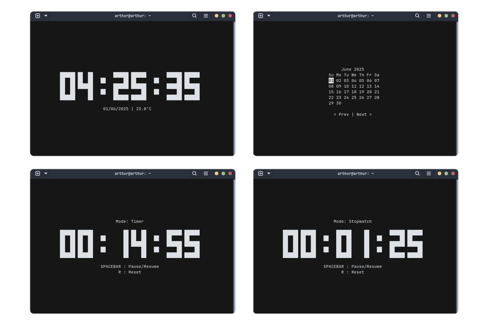

<div align="center">
 <h1>ClockTemp</h1>
 <p><b>ClockTemp</b> is a TUI clock inspired by <a href="https://github.com/xorg62/tty-clock">tty-clock</a> that displays the time, date, temperature and more.</p><br>
 
 
 
 
 <a href="#installation">Installation</a> • <a href="#remove-clocktemp">Uninstall</a> • <a href="#commands-and-interactive-keys-list">Commands and Keys</a> • <a href="#credits">Credits</a> • <a href="#resources-used">Resources Used</a>  
</div>

## Installation

> [как это скачать]

1.копируйте рипозиторий
 ```
 git clone https://github.com/dantas-arthur/ClockTemp.git
 ```

2. откройте
  ```
  cd ваша/диерктория/ClockTemp/script
  ```
3. запустите этот код для устоновки
 ```
 sudo ./install.sh
 ```
4.  запустите програму с помощью команды  clocktemp
```
 clocktemp
 ```

 
 ```
